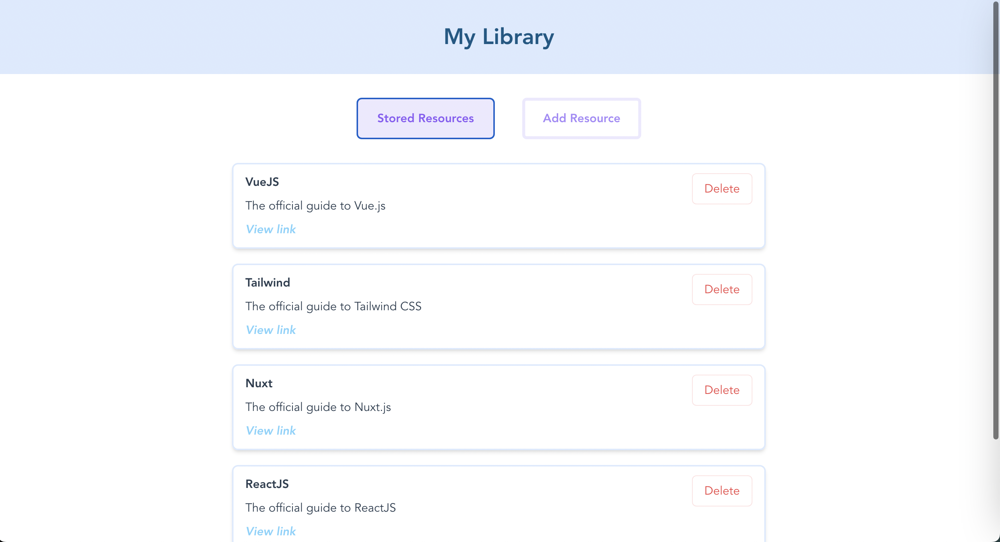
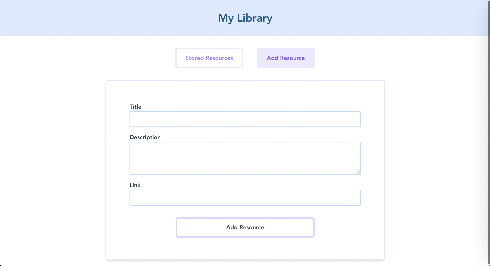
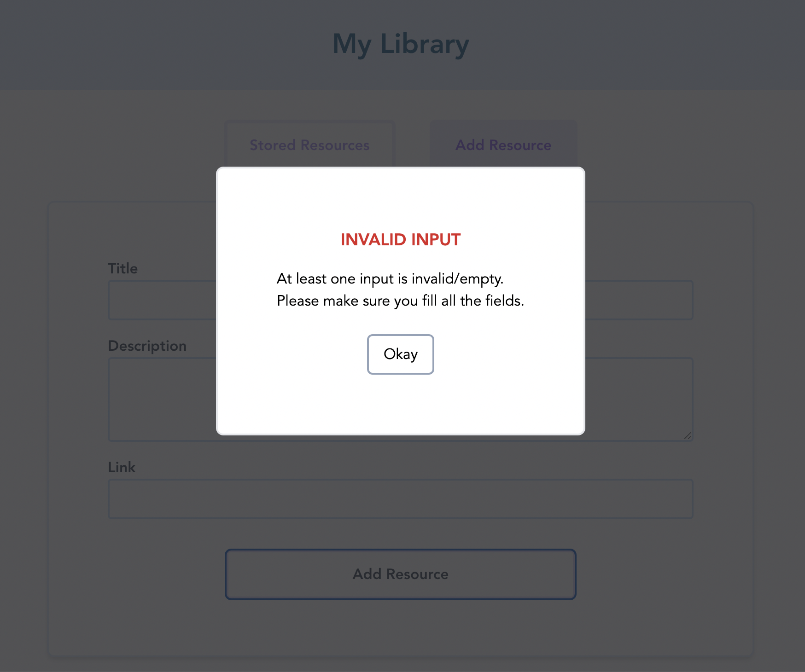
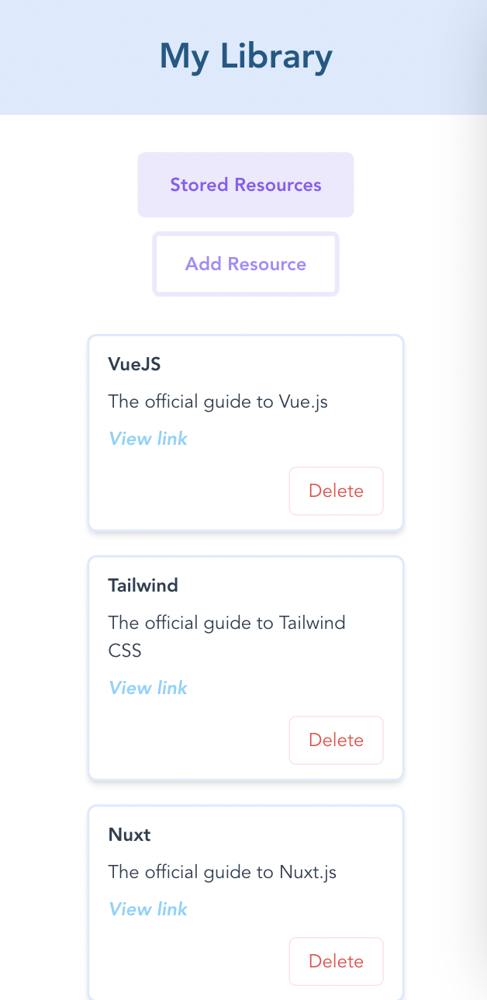
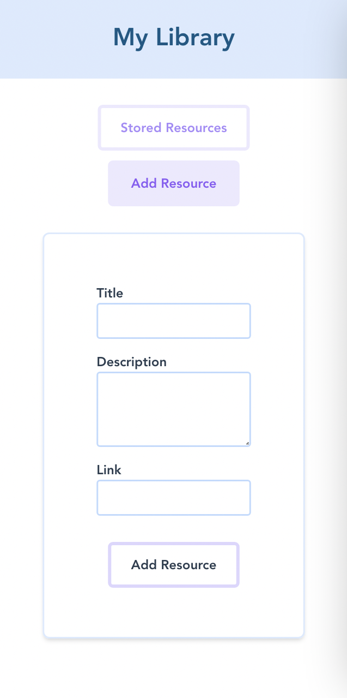

# Development Resources App
A responsive web app built with Vue.js and styled with Tailwind that lets users store, add and delete learning, development or technology resources.

<p align="center">
  
</p>

<p align="center">
  
</p>

<p align="center">
  
</p>

<p align="center">
  
  
</p>

## Project setup

### VueJS app:
1. Install packages &  dependencies: `npm install`
2. Compiles and hot-reloads for development `npm run serve`
3. Compiles and minifies for production: `npm run build`
4. Lints and fixes files `npm run lint`

### Tailwind setup:
1. Install tailwind:
  ```
  npm install -D tailwindcss postcss autoprefixer
  npx tailwindcss init -p
  ```
2. Add content to tailwind config's module.exports
  ```
  module.exports = {
  content: [
    "./index.html",
    "./src/**/*.{vue,js,ts,jsx,tsx}",
  ],
  ```
3. Add tailwind directives to CSS in newly-created stylesheet:
```
// in style.css
@tailwind base;
@tailwind components;
@tailwind utilities;
```
4. Import this stylesheet into the app:
```
// in main.js
import './style.css'
``` 

## Learnings:
- `<teleport to="body"></teleport>` allows you to reorganise the DOM (if you have an `absolute`-positioned component for example)
- `provide` and `inject` can be used instead of props to pass data along
  ```javascript
  // $StoredResources.vue
  export default {
    inject: ['resources'],
  }

  // $TheResources.vue
  export default {
    // data() {
    //   return {
    //     storedResources: [
    //       ...
    //     ]
    //   }
    // },
    provide() {
      return {
        resources: this.storedResources, // this provides the resources to all child components
      };
    }
  }
  ```
- (Component names should be more than 1 word long. `Resources.vue` &rarr; `TheResources.vue`)
- Slots:
  ```html
  <slot name="actions"></slot>
  <slot></slot> // = <slot name="default"></slot>
  ```
    - If more than one slot (say *n* slots), slot names must be given to *n-1* slots (the one without the name gets the name "default")
    - One way to name slots(above), but two ways to 'call' the slot:
    ```html
    <template #default></template>
    <template #actions></template>
    // or
    <template v-slot:actions></template>
    ```
- `<keep-alive></keep-alive>` "holds onto" the component, so that the data won't be lost when toggling between states (e.g. between the Stored Resources tab and the Add Resource tab)
- How to add opacity to a colour in tailwind: `bg-zinc-800/[.8]`